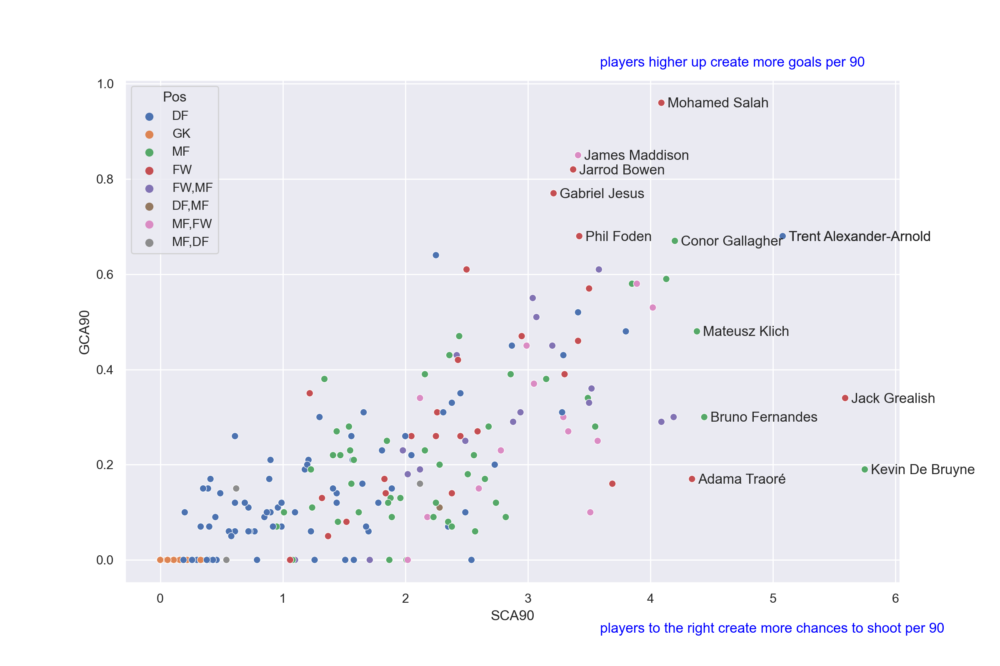
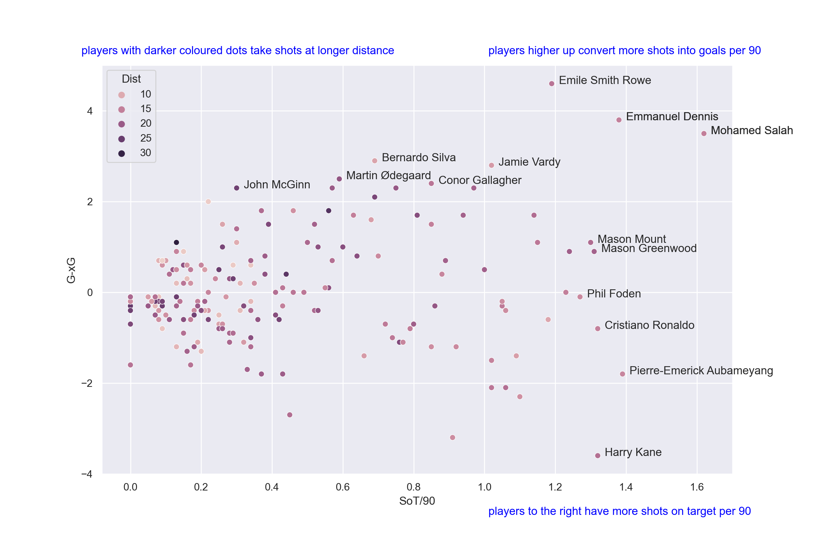
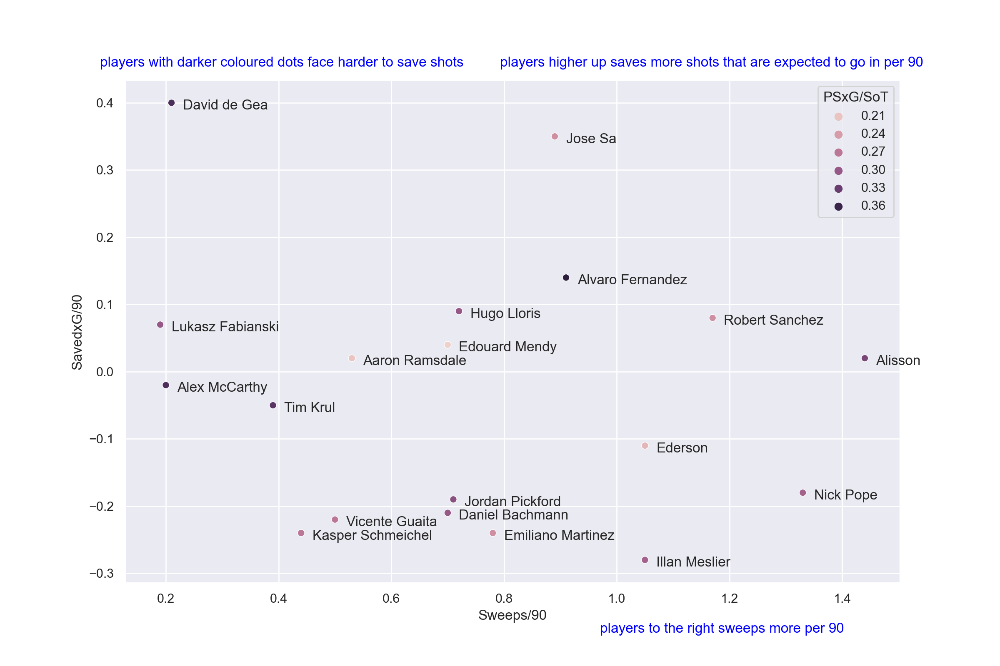

# EPL_Visuals
Visualization of English Premier League stats, detailed work in [my workbook](EPL_Visual_workbook.ipynb)

raw data from [fbref.com](https://fbref.com/en/comps/9/Premier-League-Stats)

last updated: Jan 13, 2022

## Best creators/playmakers(at pleast 10 full games played):
X axis shows how many shot-creating actions per 90 mins player has, Y axis shows how many goal-creating actions per 90 mins.

Mohamed Salah, James Maddison and Jarrod Bowen, etc. are elites, creating a lot of shots and a lot of goals; Jack Grealish and Kevin De Bruyne creats lot of shots but not always lead to goals. Trent Alexander-Arnold as a right back is very impressive so high up on this graph

## Best finishers(at pleast 10 full games played):
X axis shows how many shots on target per 90 mins player has, Y axis shows how clinical players are: players higher up finish more chances than expected(more clinical)

Harry Kane still had many shots on target this season, but not many led to goals(wasteful)
Emile Smith Rowe, Emmanuel Dennis and Mohamed Salah are elites, not only have many shots on target, but scored more goals than expected

## Best goalkeepers(at pleast 10 full games played):
X axis shows how many sweeping actions a player has, Y axis shows how good a player is at saving shots(compared to average keepers)

David de Gea and Jose Sa are two standouts this season at shot-stopping, especially David de Gea faced very difficult to save shots, but he shows his limitation at sweeping outside of penalty box.
